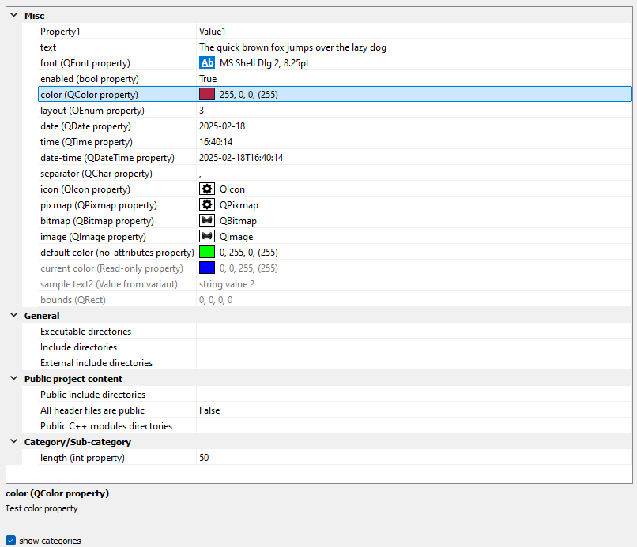

# PmPropertyGrid

[](https://github.com/Nanticock/PmPropertyGrid/actions/workflows/windows.yml)
[](https://github.com/Nanticock/PmPropertyGrid/actions/workflows/macos.yml)
[](https://github.com/Nanticock/PmPropertyGrid/actions/workflows/linux.yml)

A modern, feature-rich property grid widget for C++ applications (currently supporting Qt, but with more GUI frameworks support planned for the future).</br>
This library provides a flexible and customizable property editor that displays object properties in a tree-like structure, similar to property editors found in IDEs and game engines.



> **⚠️ Early Release Notice**
> 
> This project is shared in connection with the YouTube video: [Building a Property Grid Widget in Qt/C++](https://youtu.be/O-O_c6Ymz8w?si=iEY5bG8kDndACx_v) Published on C++Online 2025

> **Current Status:**
> - ✅ **API is stable** - Safe to use in your projects without worrying about breaking changes
> - ⚠️ **Implementation is not fully polished** - Some features may have rough edges
> - 🚧 **Work in progress** - Actively being improved to become production-ready
> 
> Feel free to use it, report issues, and contribute! The core functionality works well, and the API won't change in ways that break your code.

## Quick Start

```cpp
#include <PropertyGrid.h>

#include <QApplication>

int main(int argc, char *argv[])
{
    QApplication app(argc, argv);
    
    PM::PropertyGrid propertyGrid;
    
    // Add simple properties
    propertyGrid.addProperty("Name", QString("My Object"));
    propertyGrid.addProperty("Enabled", true);
    propertyGrid.addProperty("Color", QColor(Qt::red));
    
    // Add properties with attributes
    propertyGrid.addProperty("Width", 100, 
        PM::DescriptionAttribute("Object width in pixels"),
        PM::DefaultValueAttribute(50),
        PM::CategoryAttribute("Geometry"));
    
    // Add read-only property
    propertyGrid.addProperty("Status", QString("Ready"), 
        PM::ReadOnlyAttribute());
    
    // Connect to value changes
    QObject::connect(&propertyGrid, &PM::PropertyGrid::propertyValueChanged,
        [](const PM::PropertyContext &context) {
            qDebug() << "Property" << context.property().name 
                     << "changed to" << context.value();
        });
    
    propertyGrid.show();
    return app.exec();
}
```

## Features

- **Comprehensive Type Support**: Planned Built-in support for all major Qt types including:
  - [x] **Basic types**: `int`, `bool`, `QString`, `double`
  - [ ] **Geometric types**: `QPoint`, `QPointF`, `QSize`, `QSizeF`, `QRect`, `QRectF`, `QLine`, `QLineF`
  - [x] **Graphics types**: `QColor`, `QFont`, `QIcon`, `QPixmap`, `QBitmap`, `QImage`
  - [ ] **Advanced types**: `QVector2D`, `QVector3D`, `QVector4D`, `QMatrix4x4`, `QPolygon`, `QPolygonF`
  - [x] **Date/Time types**: `QDate`, `QTime`, `QDateTime`
  - [ ] **UI types** (partial): `QKeySequence`, `QCursor`, `QChar`
  - [ ] **Object types**: `QObject*` and custom enums

- **Property Attributes**: Rich attribute system for enhanced property configuration:
  - `DescriptionAttribute`: Add helpful descriptions to properties
  - `DefaultValueAttribute`: Define default values for properties
  - `CategoryAttribute`: Organize properties into collapsible categories
  - `ReadOnlyAttribute`: Mark properties as read-only

- **Flexible API**: Multiple ways to add properties:
  - Simple property addition with automatic type detection
  - Detailed property configuration with attributes
  - Batch property addition with categories

- **Interactive Features**:
  - Collapsible categories for better organization
  - Real-time property value change notifications
  - Support for custom property editors
  - Responsive tree-based layout

- **Cross-Platform**: Compatible with Qt 5.9+ on Windows, macOS, and Linux

- **Wide Qt Compatibility**: Designed to work with all Qt versions from Qt 5.9 onward, ensuring maximum compatibility across projects

## Requirements

- **CMake**: 3.10 or higher
- **Qt**: 5.9+ (Widgets module required)
- **C++ Standard**: C++17 (can work on C++14 if you have a replacement implementation for `std::variant`)
- **Compiler**: MSVC 2019, GCC, or Clang with C++17 support

## API Overview

### Core Classes

- **`PM::PropertyGrid`**: Main widget for displaying and editing properties
- **`PM::Property`**: Represents a single property with type information and attributes
- **`PM::PropertyContext`**: Provides context for property operations including current value
- **`PM::PropertyEditor`**: Base class for custom property editors

### Attribute System

The library uses a flexible attribute system to enhance property behavior:

```cpp
// Property with description and default value
propertyGrid.addProperty("Opacity", 1.0f,
    PM::DescriptionAttribute("Object transparency (0.0 - 1.0)"),
    PM::DefaultValueAttribute(0.5f));

// Categorized read-only property
propertyGrid.addProperty("Object ID", 12345,
    PM::CategoryAttribute("System"),
    PM::ReadOnlyAttribute());
```

## Building

### Using CMake

```bash
mkdir build
cd build
cmake ..
cmake --build .
```

### Integrating into Your Project

You can easily integrate PmPropertyGrid into your CMake project using `add_subdirectory`:

```cmake
# Add PmPropertyGrid as a subdirectory and disable examples
set(PM_BUILD_PROPERTY_GRID_EXAMPLES OFF)
add_subdirectory(path/to/PmPropertyGrid)

# Link against your target
target_link_libraries(your_target_name PRIVATE PmPropertyGrid)
```

**Note**: Currently, the library only supports static linking. Shared library support will be added in the future.

#### Complete Example

```cmake
cmake_minimum_required(VERSION 3.10)
project(MyProject)

# Find Qt
find_package(QT NAMES Qt6 Qt5 COMPONENTS Widgets REQUIRED)
find_package(Qt${QT_VERSION_MAJOR} COMPONENTS Widgets REQUIRED)

# Add PmPropertyGrid
set(PM_BUILD_PROPERTY_GRID_EXAMPLES OFF)
add_subdirectory(third_party/PmPropertyGrid)

# Create your executable
add_executable(MyApp main.cpp)

# Link Qt and PmPropertyGrid
target_link_libraries(MyApp PRIVATE
    Qt${QT_VERSION_MAJOR}::Widgets
    PmPropertyGrid
)
```

## Examples

The `examples/property_grid_showcase` directory contains a comprehensive demonstration of the library's capabilities, showcasing:

- All supported property types
- Property attributes and categorization
- Interactive property editing
- Real-time value change handling

## Project Structure

```
PmPropertyGrid/
├── src/                        # Core library source code
│   ├── PropertyGrid.h/cpp      # Main property grid widget
│   ├── Property.h/cpp          # Property definition and attributes
│   ├── PropertyContext.h/cpp   # Property definition, value and associated meta info
│   └── PropertyEditor.h/cpp    # Property editor framework
├── examples/                   # Example applications
│   └── property_grid_showcase/ # Comprehensive demo
├── cmake/                      # CMake modules (coming soon)
└── tests/                      # Unit tests (coming soon)
```

## License

This project is licensed under the MIT License - see the [LICENSE](LICENSE) file for details.

## Contributing

Contributions are welcome! Please feel free to submit pull requests, report bugs, or suggest new features.
