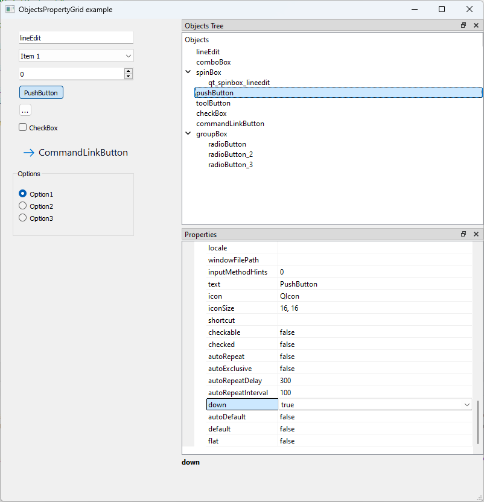

# Object Property Grid Example

## Overview
This example demonstrates how to integrate a custom **ObjectPropertyGrid** into a Qt application. The property grid allows inspection and editing of common properties across multiple selected `QObject` instances. It is designed to behave similarly to the property grid found in development environments, showing shared properties and synchronizing changes back to the selected objects.

## Features
- Uses `QMetaProperty` introspection to dynamically build the grid.
- Displays only properties that are common across all selected objects.
- Supports both single and multiple object selection.
- Updates property values directly on the underlying `QObject` instances.

## How It Works
1. The tree view lists child widgets of the central widget.
2. Selecting one or more items updates the property grid with common properties.
3. Editing a property in the grid applies the change to all selected objects.
4. Connections are cleared and rebuilt whenever the selection changes to avoid stale signal bindings.

## Structure
- **MainWindow**: Demonstrates usage by populating a tree of widgets and connecting selection changes to the property grid.
- **ObjectPropertyGrid**: Inherits from `PM::PropertyGrid` and manages the selected objects and property display.